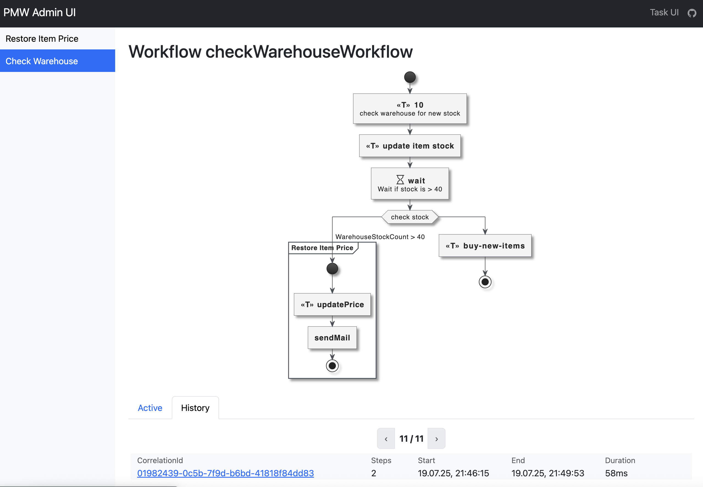

# Poor Mans Workflow for Spring

## Design-Goals

Build a very basic workflow `engine` which does only really basic stuff and is understood in a second.

-   one simple jar to get it running
-   no own deployment of a workflow server or any stuff
-   Java DSL, keep the code in java
-   Visual representation of the workflow

## ToDo

-   [x] First Spring integration
-   [x] First PlantUML integration
-   [x] Wait as own step
-   [x] Await and resume
-   [x] Transactional and non transactional steps
-   [x] Trigger workflows in an own step
-   [x] Link to workflows in repository using `trigger->`
-   [ ] Error steps
