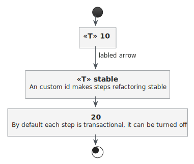

## Step IDs

By default, each step is enumerated with a numerical step ID incrementing by 10. This allows custom steps to be inserted later using a specific ID.

Nevertheless, the most stable approach is to assign custom `ids` to each step. If the workflow is refactored or any step is moved, using a custom ID will keep the workflow stable and refactoring safe.

Removing workflow steps should be done with a rolling installation:

1. First, remove any function from the step by using a noop: `s -> {}`
1. Later, remove the step entirely once any active workflows are completed and will not be retriggered

## Transactions

By default any step is assumed to be transactional. If a steps does any remote calls etc. it the transaction should be turned off.

!!! info

    The state will not be saved in case of an exception. Each retry will have the same state as before.

## Retry strategy

It is used for each step and defines how each step in a workflow is retried in case it failed.

```java
@Bean
simpleWorkflow() {
  return Workflow.builder("test-workflow", SimpleWorkflowState::new)
    .next(s -> {})
    .next()
        .id("stable")
        .description("An custom id makes steps refactoring stable")
        .connectorLabel("labeled arrow")
        .function(e -> {})
        .build()
    .next()
        .description("By default each step is transactional, it can be turned off")
        .function(e -> {})
        .transactional(false)
        .build()
    .stepRetryStrategy(RetryStrategy.THREE_RETRIES_IMMEDIATELY)
    .build();
}
```


