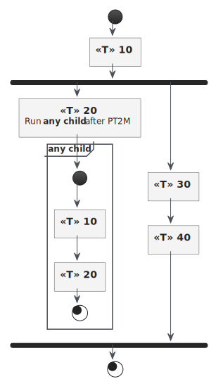

### Child workflow

```java
@Bean
void childWorkflow() {
  return Workflow.builder("any child", () -> Integer.valueOf(0))
                 .next(s -> {})
                 .next(s -> {})
                 .build();
}
```

### Parent Workflow fork a different workflkow

```java
void parent(Workflow<Integer> childWorkflow) {
  return Workflow.builder("parent", () ->  new SimpleWorkflowState())
    .next(s -> {})
    .forkWorkflow(childWorkflow)
        // starting a new workflow may requirer a state mapping
        .function(s -> Integer.valueOf(2))
        .delay(Duration.ofMinutes(2))
        .build()
    .next(s -> {})
    .next(s -> {})
    .build();
}
```


